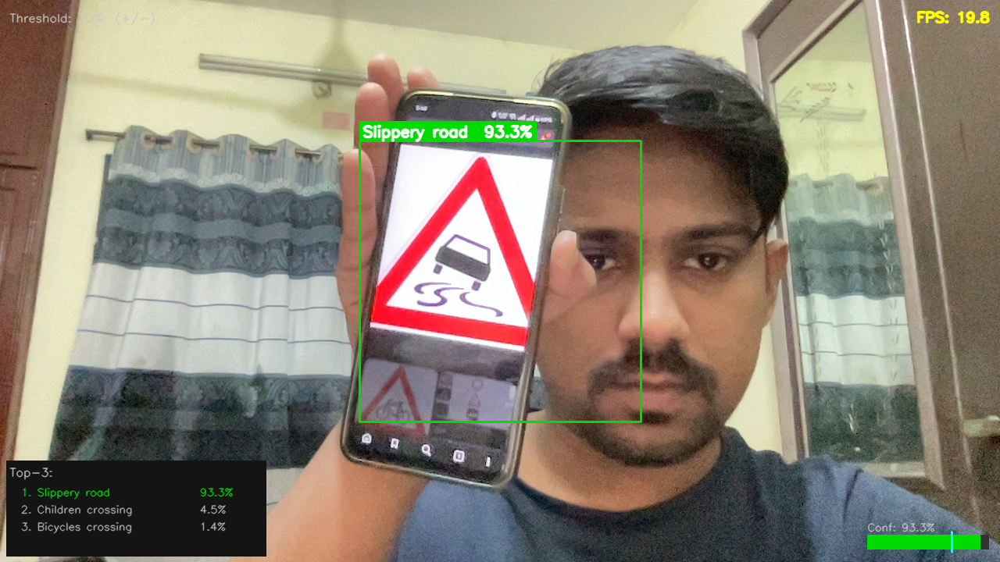

# 🚦 Traffic Sign Classifier

Real-time traffic sign recognition using **EfficientNet-B0** trained on the [GTSRB dataset](https://benchmark.ini.rub.de/) (43 classes, 50,000+ images).



---

## Results

| Metric | Score |
|---|---|
| **Test Accuracy** | **98.10%** |
| Macro F1 | 97.86% |
| Weighted F1 | 98.10% |
| Val Accuracy (best epoch) | 99.77% |
| Training Time (M1 MacBook) | ~2h 7min |

> 5 out of 43 classes below 95% accuracy — see [confusion matrix](results/confusion_matrix.png) and [per-class breakdown](results/per_class_accuracy.png).

---

## Demo

### Real-time webcam inference
Hold a printed (or screen-displayed) traffic sign in front of your camera.
The model crops the centre ROI, classifies it, and overlays the prediction with confidence.

```bash
python -m src.inference --webcam
```

| Key | Action |
|---|---|
| `Q` | Quit |
| `S` | Save screenshot |
| `+` / `-` | Adjust confidence threshold |

### Single image
```bash
python -m src.inference --image path/to/sign.jpg
```

### Batch folder → CSV
```bash
python -m src.inference --folder data/processed/test --output results/predictions.csv
```

---

## Model Architecture

```
Input (3 × 128 × 128)
  └─ EfficientNet-B0 backbone (pretrained ImageNet)
       └─ Global Average Pool → (1280,)
            └─ Channel Attention (SE block)
                 └─ Dropout(0.4)
                      └─ Linear(1280 → 512) + BatchNorm + ReLU
                           └─ Dropout(0.3)
                                └─ Linear(512 → 43)
                                     └─ Logits
```

**Total parameters:** 4,891,303  
**Two-phase training:**
- Phase 1 (epochs 1–5): backbone frozen, head trained at `lr=1e-3`
- Phase 2 (epochs 6–30): full fine-tuning at `lr=3.3e-4` with cosine decay

---

## Dataset

**GTSRB — German Traffic Sign Recognition Benchmark**

| Split | Images |
|---|---|
| Train | 31,368 |
| Val | 7,841 |
| Test | 12,630 |
| **Total** | **51,839** |

The dataset has significant class imbalance (up to ~10× ratio between most and least common classes). This is handled with **inverse-frequency weighted CrossEntropyLoss**.

---

## Quickstart

### 1. Clone & install

```bash
git clone https://github.com/tajwarchy/traffic-sign-classifier.git
cd traffic-sign-classifier
pip install -r requirements.txt
```

### 2. Download dataset

Set up your [Kaggle API key](https://www.kaggle.com/settings) at `~/.kaggle/kaggle.json`, then:

```bash
python data/download_gtsrb.py
```

### 3. Compute dataset statistics

```bash
python data/data_stats.py
```

### 4. Train

```bash
python -m src.train
```

All hyperparameters are in `configs/train_config.yaml` — no hardcoded values.

### 5. Evaluate

```bash
python -m src.evaluate
```

### 6. Run inference

```bash
# Webcam
python -m src.inference --webcam

# Single image
python -m src.inference --image path/to/sign.jpg

# Video file
python -m src.inference --video path/to/video.mp4
```

---

## Project Structure

```
traffic-sign-classifier/
├── data/
│   ├── download_gtsrb.py       # Download + organise dataset
│   └── data_stats.py           # EDA: class distribution, image sizes
├── src/
│   ├── models/
│   │   ├── efficientnet_backbone.py   # EfficientNet-B0 + freeze helpers
│   │   └── classifier.py             # Full model + factory function
│   ├── augmentation.py         # Albumentations pipelines
│   ├── dataset.py              # GTSRBDataset + DataLoader factory
│   ├── train.py                # Two-phase training loop
│   ├── evaluate.py             # Confusion matrix, F1, class report
│   └── inference.py            # Single / batch / webcam / video
├── configs/
│   └── train_config.yaml       # All hyperparameters
├── weights/
│   └── best_model.pth          # Trained weights (not tracked by git)
├── results/
│   ├── confusion_matrix.png
│   ├── per_class_accuracy.png
│   ├── worst_classes.png
│   ├── class_report.txt
│   └── metrics.json
└── requirements.txt
```

---

## Training Details

| Hyperparameter | Value |
|---|---|
| Backbone | EfficientNet-B0 (ImageNet pretrained) |
| Image size | 128 × 128 |
| Batch size | 64 |
| Phase 1 LR | 1e-3 (head only) |
| Phase 2 LR | 3.3e-4 → 1e-6 (cosine) |
| Weight decay | 1e-4 |
| Epochs | 30 (5 frozen + 25 fine-tune) |
| Loss | CrossEntropyLoss (class-weighted) |
| Scheduler | CosineAnnealingLR |
| Augmentation | Albumentations (blur, noise, dropout, perspective, shadow) |

---

## Tech Stack

- **Framework:** PyTorch 2.x
- **Backbone:** timm (EfficientNet-B0)
- **Augmentation:** Albumentations
- **Evaluation:** scikit-learn
- **Visualisation:** Matplotlib, Seaborn
- **Inference:** OpenCV

---

## Relevance

Traffic sign recognition is a core perception task in **autonomous driving** pipelines. This project demonstrates:
- Multi-class classification at scale (43 classes)
- Handling real-world class imbalance
- Production-ready inference with confidence thresholding
- Two-phase fine-tuning strategy applicable to any pretrained backbone